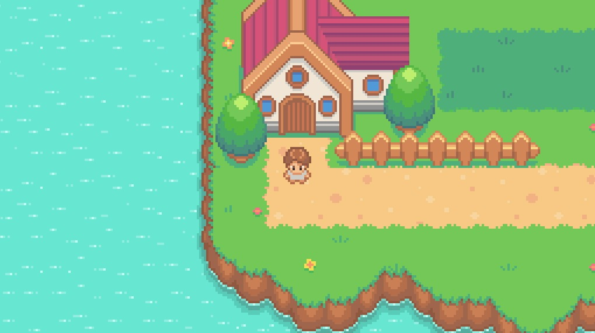

# Pokemon Game

## Description
This is a mini, Pokemon-like game. The user can walk around the town and if they go into a dark green patch, there is a chance a battle will be initiated.

In a battle, the user can use their monster "Emby" to battle the monster "Draggle".

## Table of Contents
- [Website Links](#website-links)
- [Technical Stack](#technical-stack)
- [Questions](#questions)
- [Acknowledgements and Credits](#acknowledgements-and-credits)
- [Preview](#preview)

## Website Links
- [Deployed App Through Heroku](https://wald14.github.io/pokemonGame/)
- [GitHub Repo](https://github.com/Wald14/pokemonGame)

## Technical Requirements

Technical requirements for the application include:
- JavaScript
- HTML
- CSS
- [Howler JS Library](https://cdnjs.com/libraries/howler)
- [gsap JS Library](https://cdnjs.com/libraries/gsap)

## Questions
Questions can be received on the [Github Repository](https://github.com/Wald14/pokemonGame) for this application. Please make a new issue.

## Acknowledgements and Credits
- Special shout out to [Chris Lis](https://chriscourses.com/courses/pokemon/videos/introduction) - I followed along and expanded upon Chris' tutorial for building a pokemon web app.

## Preview
The following images share the application's apperance:

### Town

### Battle
